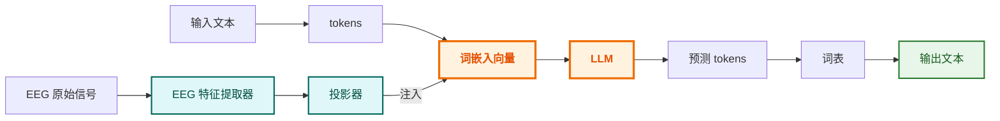

```mermaid
flowchart LR
    A[输入文本]:::input
    A --> C[tokens]:::process
    C --> D[词嵌入向量]:::embedding
    D --> E[LLM]:::core
    E --> F[预测 tokens]:::process
    F --> G[词表]:::process
    G --> H[输出文本]:::output

    I[EEG 原始信号]:::input --> J[EEG 特征提取器]:::eeg
    J --> K[投影器]:::eeg
    K -- 注入 --> D


    classDef embedding fill:#fff3e0,stroke:#ef6c00,stroke-width:3px,color:#e65100,font-weight:bold
    classDef output fill:#e8f5e9,stroke:#2e7d32,stroke-width:2px,color:#1b5e20
    classDef core fill:#fff3e0,stroke:#ef6c00,stroke-width:3px,color:#e65100,font-weight:bold
    classDef eeg fill:#e0f7fa,stroke:#00695c,stroke-width:2px,color:#004d40
```

